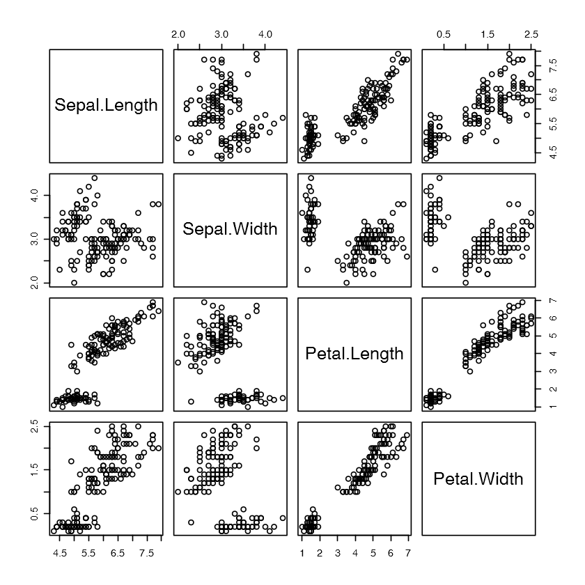

## 30 seconds of r-code

Base-R expressions to get some basic things done in less than 30 seconds. 

#### Related:

* [Javasrcript](https://github.com/Chalarangelo/30-seconds-of-code)
* [Python](https://github.com/kriadmin/30-seconds-of-python-code)
* [css](https://github.com/atomiks/30-seconds-of-css)

**Table of contents**


  * [Creating a 10\*10 matrix with random numbers](#creating-a-10--10-matrix-with-random-numbers)
  * [Matrix to Dataframe](#matrix-to-dataframe)
  * [Scatter Plot to understand Correlation](#scatter-plot-to-understand-correlation)
  * [Correlation Matrix](#correlation-matrix)
  * [Dimension of a dataframe](#dimension-of-a-dataframe)
  * [Transposing a dataframe](#transposing-a-dataframe)
  * [Group Count](#group-count)
  * [Grouped Airthmetic Operation](#grouped-airthmetic-operation)
  * [New Function Creationg (String Concatenation)](#new-function-creationg--string-concatenation-)
  * [Current Time and Date](#current-time-and-date)
  * [Boolean to Integer Typecasting](#boolean-to-integer-typecasting)
  * [Counting Number of Characters in a string](#counting-number-of-characters-in-a-string)
  * [Counting Number of Words in a string](#counting-number-of-words-in-a-string)
  * [Length of each word in a string](#length-of-each-word-in-a-string)
  * [Extracting Words starting with 's' in a string](#extracting-words-starting-with--s--in-a-string)
  * [String to Lower Case and to Upper Case](#string-to-lower-case-and-to-upper-case)
  * [String Find and Replace](#string-find-and-replace)


### Creating a 10\*10 matrix with random numbers


```R
set.seed(123)
new_matrix <- matrix(rnorm(100), nrow = 10, ncol = 10)
new_matrix
```


<table>
<tbody>
	<tr><td>-0.56047565 </td><td> 1.2240818  </td><td>-1.0678237  </td><td> 0.42646422 </td><td>-0.69470698 </td><td> 0.25331851 </td><td> 0.37963948 </td><td>-0.4910312  </td><td> 0.005764186</td><td> 0.9935039  </td></tr>
	<tr><td>-0.23017749 </td><td> 0.3598138  </td><td>-0.2179749  </td><td>-0.29507148 </td><td>-0.20791728 </td><td>-0.02854676 </td><td>-0.50232345 </td><td>-2.3091689  </td><td> 0.385280401</td><td> 0.5483970  </td></tr>
	<tr><td> 1.55870831 </td><td> 0.4007715  </td><td>-1.0260044  </td><td> 0.89512566 </td><td>-1.26539635 </td><td>-0.04287046 </td><td>-0.33320738 </td><td> 1.0057385  </td><td>-0.370660032</td><td> 0.2387317  </td></tr>
	<tr><td> 0.07050839 </td><td> 0.1106827  </td><td>-0.7288912  </td><td> 0.87813349 </td><td> 2.16895597 </td><td> 1.36860228 </td><td>-1.01857538 </td><td>-0.7092008  </td><td> 0.644376549</td><td>-0.6279061  </td></tr>
	<tr><td> 0.12928774 </td><td>-0.5558411  </td><td>-0.6250393  </td><td> 0.82158108 </td><td> 1.20796200 </td><td>-0.22577099 </td><td>-1.07179123 </td><td>-0.6880086  </td><td>-0.220486562</td><td> 1.3606524  </td></tr>
	<tr><td> 1.71506499 </td><td> 1.7869131  </td><td>-1.6866933  </td><td> 0.68864025 </td><td>-1.12310858 </td><td> 1.51647060 </td><td> 0.30352864 </td><td> 1.0255714  </td><td> 0.331781964</td><td>-0.6002596  </td></tr>
	<tr><td> 0.46091621 </td><td> 0.4978505  </td><td> 0.8377870  </td><td> 0.55391765 </td><td>-0.40288484 </td><td>-1.54875280 </td><td> 0.44820978 </td><td>-0.2847730  </td><td> 1.096839013</td><td> 2.1873330  </td></tr>
	<tr><td>-1.26506123 </td><td>-1.9666172  </td><td> 0.1533731  </td><td>-0.06191171 </td><td>-0.46665535 </td><td> 0.58461375 </td><td> 0.05300423 </td><td>-1.2207177  </td><td> 0.435181491</td><td> 1.5326106  </td></tr>
	<tr><td>-0.68685285 </td><td> 0.7013559  </td><td>-1.1381369  </td><td>-0.30596266 </td><td> 0.77996512 </td><td> 0.12385424 </td><td> 0.92226747 </td><td> 0.1813035  </td><td>-0.325931586</td><td>-0.2357004  </td></tr>
	<tr><td>-0.44566197 </td><td>-0.4727914  </td><td> 1.2538149  </td><td>-0.38047100 </td><td>-0.08336907 </td><td> 0.21594157 </td><td> 2.05008469 </td><td>-0.1388914  </td><td> 1.148807618</td><td>-1.0264209  </td></tr>
</tbody>
</table>


### Matrix to Dataframe


```R
set.seed(123)
new_matrix <- matrix(rnorm(100), nrow = 10, ncol = 10)
new_df <- data.frame(new_matrix)
names(new_df) <- 1:10
new_df
```


<table>
<thead><tr><th scope=col>1</th><th scope=col>2</th><th scope=col>3</th><th scope=col>4</th><th scope=col>5</th><th scope=col>6</th><th scope=col>7</th><th scope=col>8</th><th scope=col>9</th><th scope=col>10</th></tr></thead>
<tbody>
	<tr><td>-0.56047565 </td><td> 1.2240818  </td><td>-1.0678237  </td><td> 0.42646422 </td><td>-0.69470698 </td><td> 0.25331851 </td><td> 0.37963948 </td><td>-0.4910312  </td><td> 0.005764186</td><td> 0.9935039  </td></tr>
	<tr><td>-0.23017749 </td><td> 0.3598138  </td><td>-0.2179749  </td><td>-0.29507148 </td><td>-0.20791728 </td><td>-0.02854676 </td><td>-0.50232345 </td><td>-2.3091689  </td><td> 0.385280401</td><td> 0.5483970  </td></tr>
	<tr><td> 1.55870831 </td><td> 0.4007715  </td><td>-1.0260044  </td><td> 0.89512566 </td><td>-1.26539635 </td><td>-0.04287046 </td><td>-0.33320738 </td><td> 1.0057385  </td><td>-0.370660032</td><td> 0.2387317  </td></tr>
	<tr><td> 0.07050839 </td><td> 0.1106827  </td><td>-0.7288912  </td><td> 0.87813349 </td><td> 2.16895597 </td><td> 1.36860228 </td><td>-1.01857538 </td><td>-0.7092008  </td><td> 0.644376549</td><td>-0.6279061  </td></tr>
	<tr><td> 0.12928774 </td><td>-0.5558411  </td><td>-0.6250393  </td><td> 0.82158108 </td><td> 1.20796200 </td><td>-0.22577099 </td><td>-1.07179123 </td><td>-0.6880086  </td><td>-0.220486562</td><td> 1.3606524  </td></tr>
	<tr><td> 1.71506499 </td><td> 1.7869131  </td><td>-1.6866933  </td><td> 0.68864025 </td><td>-1.12310858 </td><td> 1.51647060 </td><td> 0.30352864 </td><td> 1.0255714  </td><td> 0.331781964</td><td>-0.6002596  </td></tr>
	<tr><td> 0.46091621 </td><td> 0.4978505  </td><td> 0.8377870  </td><td> 0.55391765 </td><td>-0.40288484 </td><td>-1.54875280 </td><td> 0.44820978 </td><td>-0.2847730  </td><td> 1.096839013</td><td> 2.1873330  </td></tr>
	<tr><td>-1.26506123 </td><td>-1.9666172  </td><td> 0.1533731  </td><td>-0.06191171 </td><td>-0.46665535 </td><td> 0.58461375 </td><td> 0.05300423 </td><td>-1.2207177  </td><td> 0.435181491</td><td> 1.5326106  </td></tr>
	<tr><td>-0.68685285 </td><td> 0.7013559  </td><td>-1.1381369  </td><td>-0.30596266 </td><td> 0.77996512 </td><td> 0.12385424 </td><td> 0.92226747 </td><td> 0.1813035  </td><td>-0.325931586</td><td>-0.2357004  </td></tr>
	<tr><td>-0.44566197 </td><td>-0.4727914  </td><td> 1.2538149  </td><td>-0.38047100 </td><td>-0.08336907 </td><td> 0.21594157 </td><td> 2.05008469 </td><td>-0.1388914  </td><td> 1.148807618</td><td>-1.0264209  </td></tr>
</tbody>
</table>


### Scatter Plot to understand Correlation


```R
plot(iris[,1:4])
```





### Correlation Matrix


```R
cor(iris[,1:4])
```


<table>
<thead><tr><th></th><th scope=col>Sepal.Length</th><th scope=col>Sepal.Width</th><th scope=col>Petal.Length</th><th scope=col>Petal.Width</th></tr></thead>
<tbody>
	<tr><th scope=row>Sepal.Length</th><td> 1.0000000</td><td>-0.1175698</td><td> 0.8717538</td><td> 0.8179411</td></tr>
	<tr><th scope=row>Sepal.Width</th><td>-0.1175698</td><td> 1.0000000</td><td>-0.4284401</td><td>-0.3661259</td></tr>
	<tr><th scope=row>Petal.Length</th><td> 0.8717538</td><td>-0.4284401</td><td> 1.0000000</td><td> 0.9628654</td></tr>
	<tr><th scope=row>Petal.Width</th><td> 0.8179411</td><td>-0.3661259</td><td> 0.9628654</td><td> 1.0000000</td></tr>
</tbody>
</table>


### Dimension of a dataframe


```R
dim(iris)
```


<ol class=list-inline>
	<li>150</li>
	<li>5</li>
</ol>


### Transposing a dataframe


```R
t(iris)
```


<table>
<tbody>
	<tr><th scope=row>Sepal.Length</th><td>5.1      </td><td>4.9      </td><td>4.7      </td><td>4.6      </td><td>5.0      </td><td>5.4      </td><td>4.6      </td><td>5.0      </td><td>4.4      </td><td>4.9      </td><td>...      </td><td>6.7      </td><td>6.9      </td><td>5.8      </td><td>6.8      </td><td>6.7      </td><td>6.7      </td><td>6.3      </td><td>6.5      </td><td>6.2      </td><td>5.9      </td></tr>
	<tr><th scope=row>Sepal.Width</th><td>3.5      </td><td>3.0      </td><td>3.2      </td><td>3.1      </td><td>3.6      </td><td>3.9      </td><td>3.4      </td><td>3.4      </td><td>2.9      </td><td>3.1      </td><td>...      </td><td>3.1      </td><td>3.1      </td><td>2.7      </td><td>3.2      </td><td>3.3      </td><td>3.0      </td><td>2.5      </td><td>3.0      </td><td>3.4      </td><td>3.0      </td></tr>
	<tr><th scope=row>Petal.Length</th><td>1.4      </td><td>1.4      </td><td>1.3      </td><td>1.5      </td><td>1.4      </td><td>1.7      </td><td>1.4      </td><td>1.5      </td><td>1.4      </td><td>1.5      </td><td>...      </td><td>5.6      </td><td>5.1      </td><td>5.1      </td><td>5.9      </td><td>5.7      </td><td>5.2      </td><td>5.0      </td><td>5.2      </td><td>5.4      </td><td>5.1      </td></tr>
	<tr><th scope=row>Petal.Width</th><td>0.2      </td><td>0.2      </td><td>0.2      </td><td>0.2      </td><td>0.2      </td><td>0.4      </td><td>0.3      </td><td>0.2      </td><td>0.2      </td><td>0.1      </td><td>...      </td><td>2.4      </td><td>2.3      </td><td>1.9      </td><td>2.3      </td><td>2.5      </td><td>2.3      </td><td>1.9      </td><td>2.0      </td><td>2.3      </td><td>1.8      </td></tr>
	<tr><th scope=row>Species</th><td>setosa   </td><td>setosa   </td><td>setosa   </td><td>setosa   </td><td>setosa   </td><td>setosa   </td><td>setosa   </td><td>setosa   </td><td>setosa   </td><td>setosa   </td><td>...      </td><td>virginica</td><td>virginica</td><td>virginica</td><td>virginica</td><td>virginica</td><td>virginica</td><td>virginica</td><td>virginica</td><td>virginica</td><td>virginica</td></tr>
</tbody>
</table>


### Group Count


```R
table(iris$Species)
```


    
        setosa versicolor  virginica 
            50         50         50 


### Grouped Airthmetic Operation


```R
aggregate(Sepal.Width ~ Species, iris,FUN=mean) 
aggregate(Sepal.Width ~ Species, iris,FUN=max)
```


<table>
<thead><tr><th scope=col>Species</th><th scope=col>Sepal.Width</th></tr></thead>
<tbody>
	<tr><td>setosa    </td><td>3.428     </td></tr>
	<tr><td>versicolor</td><td>2.770     </td></tr>
	<tr><td>virginica </td><td>2.974     </td></tr>
</tbody>
</table>


<table>
<thead><tr><th scope=col>Species</th><th scope=col>Sepal.Width</th></tr></thead>
<tbody>
	<tr><td>setosa    </td><td>4.4       </td></tr>
	<tr><td>versicolor</td><td>3.4       </td></tr>
	<tr><td>virginica </td><td>3.8       </td></tr>
</tbody>
</table>


### New Function Creationg (String Concatenation)


```R
my_name_is <- function(name) {paste('My name is ',name)} #declaration
my_name_is('Optimus Prime') #Function Call
```


<span style=white-space:pre-wrap>'My name is  Optimus Prime'</span>


### Current Time and Date


```R
Sys.Date()
Sys.time()
```


<time datetime="2017-12-12">2017-12-12</time>


    [1] "2017-12-12 20:17:28 IST"


### Boolean to Integer Typecasting


```R
bool_vector <- c(T,F,T,T)
+bool_vector
```


<ol class=list-inline>
	<li>1</li>
	<li>0</li>
	<li>1</li>
	<li>1</li>
</ol>


### Counting Number of Characters in a string


```R
sentence <- 'This is a sample sentence whose length I am trying to find'
nchar(sentence)
```


58


### Counting Number of Words in a string


```R
sentence <- 'This is a sample sentence whose length I am trying to find'
length(unlist(strsplit(sentence,' ')))
```


12


### Length of each word in a string


```R
sentence <- 'This is a sample sentence whose length I am trying to find'
data.frame(words = unlist(strsplit(sentence,' ')), length = nchar(unlist(strsplit(sentence,' '))))
```


<table>
<thead><tr><th scope=col>words</th><th scope=col>length</th></tr></thead>
<tbody>
	<tr><td>This    </td><td>4       </td></tr>
	<tr><td>is      </td><td>2       </td></tr>
	<tr><td>a       </td><td>1       </td></tr>
	<tr><td>sample  </td><td>6       </td></tr>
	<tr><td>sentence</td><td>8       </td></tr>
	<tr><td>whose   </td><td>5       </td></tr>
	<tr><td>length  </td><td>6       </td></tr>
	<tr><td>I       </td><td>1       </td></tr>
	<tr><td>am      </td><td>2       </td></tr>
	<tr><td>trying  </td><td>6       </td></tr>
	<tr><td>to      </td><td>2       </td></tr>
	<tr><td>find    </td><td>4       </td></tr>
</tbody>
</table>


### Extracting Words starting with 's' in a string


```R
sentence <- 'This is a sample sentence whose length I am trying to find'
unlist(lapply(unlist(strsplit(sentence, ' ')),function(x){if(startsWith(x,'s')){x}}))
```


<ol class=list-inline>
	<li>'sample'</li>
	<li>'sentence'</li>
</ol>


### String to Lower Case and to Upper Case


```R
sentence <- 'This is a sample sentence whose length I am trying to find'
casefold(sentence,F)
casefold(sentence,T)
```


'this is a sample sentence whose length i am trying to find'


'THIS IS A SAMPLE SENTENCE WHOSE LENGTH I AM TRYING TO FIND'


### String Find and Replace


```R
sentence <- 'I good and I know a good person'
gsub('good','smart',sentence)
```


'I smart and I know a smart person'

